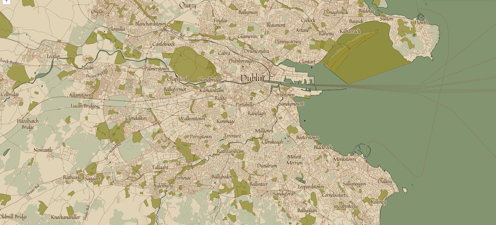

# Mapbox 16th century map
A 16th century inspired map style for mapbox, created with Mapbox Studio.

[Shared Mapbox Style link](https://api.mapbox.com/styles/v1/ezequielm/cij7hk832007dapktzdyaemih.html?fresh=true&title=true&access_token=pk.eyJ1IjoiZXplcXVpZWxtIiwiYSI6ImNpajdoaThpZjAwNWp3Z20zOWsyNW1ubXcifQ.H0i8qLcZsbWtyZPPBVZCEg#1.98/16.68/9.04)

[Live example, coupled with leaflet & markercluster](http://photos.ezequielm.com/world-map/)

* Custom Fonts/Colors/Labels at different zoom levels.
* Different effects transitions at zoom levels to mimic the inks effect.
* 7 data sets maps layered including 2 ocean depths and ice cover, national parks and greens, etc.
* Included images to overlay (see code below) to complete the look.





### JS images overlay

```
var imageUrlFolds = 'images/paperfolds_768_2.png',
imageBoundsFolds = [[90, -180], [-90, 180]];
var imageUrlNoise = 'images/noise_256.png',
imageBoundsNoise = [[90, -180], [-90, 180]];
var imageUrlShipChase = 'images/ship_chase_200.png',
imageBoundsShipChase = [[35, -75], [20, -55]];
var imageUrlShipBilander = 'images/ship_bilander_400.png',
imageBoundsShipBilander = [[0, -28], [-23, -5]];
var imageUrlShipJunk = 'images/ship_junk_300.png',
imageBoundsShipJunk = [[22, 129], [6, 145]];
var imageUrlShipketch = 'images/ship_ketch_400.png',
imageBoundsShipketch = [[6, 52], [-8, 71]];
var imageUrlShipsloop = 'images/ship_sloop_200.png',
imageBoundsShipsloop = [[-61, -44], [-69, -24]];
var imageUrlShipsgaleon = 'images/ship_galleon_300.png',
imageBoundsShipgaleon = [[53, -25], [44, -8]];

L.imageOverlay(imageUrlFolds, imageBoundsFolds, {opacity:.6}).addTo(map);
L.imageOverlay(imageUrlNoise, imageBoundsNoise, {opacity:.1}).addTo(map);
L.imageOverlay(imageUrlShipChase, imageBoundsShipChase, {opacity:0.5}).addTo(map);
L.imageOverlay(imageUrlShipBilander, imageBoundsShipBilander, {opacity:0.5}).addTo(map);
L.imageOverlay(imageUrlShipJunk, imageBoundsShipJunk, {opacity:0.5}).addTo(map);
L.imageOverlay(imageUrlShipketch, imageBoundsShipketch, {opacity:0.5}).addTo(map);
L.imageOverlay(imageUrlShipsloop, imageBoundsShipsloop, {opacity:0.5}).addTo(map);
L.imageOverlay(imageUrlShipsgaleon, imageBoundsShipgaleon, {opacity:0.5}).addTo(map);

```